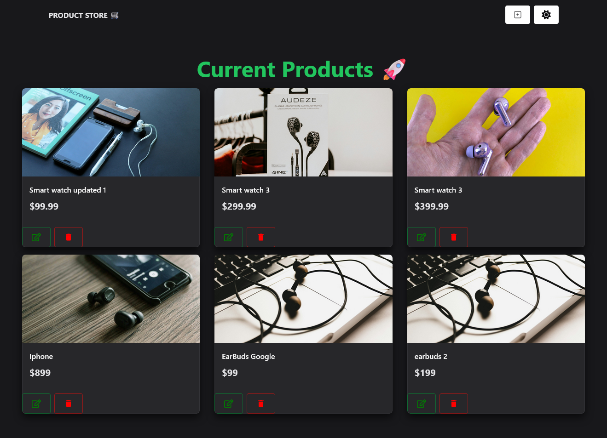

https://ecommerce-product-store-mern-tutorial.onrender.com

# E-commerce MERN Project  

Cette semaine, j'ai réalisé un mini projet full stack d'un site e-commerce développé avec MERN (MongoDB, Express.js, React, Node.js).
  
Je l'ai conçu comme un exercice pratique pour apprendre et approfondir mes connaissances, tout en mettant en œuvre les fonctionnalités de base d'un CRUD de produits.  

---

## 🎯 Objectifs du projet  

- **Apprendre la stack MERN** : back-end (API) et front-end Javascript
- **Pratique du CRUD** : gestion des produits
- **Expérimenter Chakra UI** : utilisation d'une bibliothèque de composants pour développer rapidement l'UI et ajouter des Toasts  

---

## 🛠️ Fonctionnalités  

### Front-End  
- UI responsive et simple construite avec **React** et **Chakra UI** 
- Thèmes clair et sombre avec gestion dynamique 
- Animations légères pour un retour utilisateur optimal (exemple : succès de l'ajout d'un produit).  

### Back-End  
- API créée avec **Express.js** et **Node.js** 
- Base de données **MongoDB** pour le stockage des produits via ATLAS  
- Gestion des erreurs et validation des entrées pour sécuriser les opérations avec la DB  

### CRUD Produits  
- **Créer** : nouveau produit avec un formulaire interactif
- **Lire** : affiche la liste des produits disponibles
- **Mettre à jour** : modifie les informations d'un produit existant 
- **Supprimer** : supprime un produit de la base de données

             

# E-commerce MERN Project  

This week, I built a mini full-stack e-commerce website project using the MERN stack (MongoDB, Express.js, React, Node.js).  
  
I designed it as a hands-on exercise to learn and deepen my knowledge while implementing basic CRUD functionality for products.  

---

## 🎯 Project Goals  

- **Learn the MERN stack**: back-end (API) and front-end JavaScript  
- **Practice CRUD operations**: product management  
- **Experiment with Chakra UI**: use a component library for rapid UI development and integrate Toast notifications  

---

## 🛠️ Features  

### Front-End  
- Responsive and simple UI built with **React** and **Chakra UI**  
- Light and dark themes with dynamic switching  
- Subtle animations for an optimal user experience (e.g., success notifications when adding a product).  

### Back-End  
- API created using **Express.js** and **Node.js**  
- **MongoDB** database for product storage via ATLAS  
- Error handling and input validation to ensure secure database operations  

### Product CRUD Operations  
- **Create**: Add new products through an interactive form  
- **Read**: Display a list of available products  
- **Update**: Edit existing product details  
- **Delete**: Remove products from the database  

